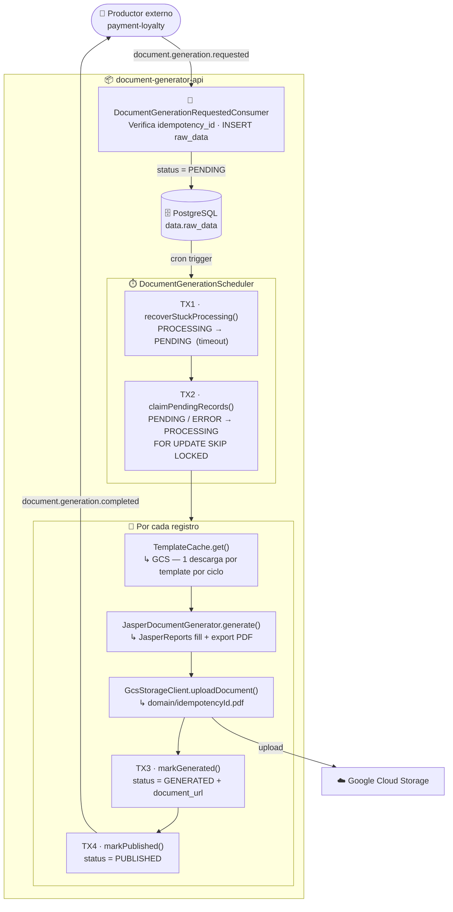
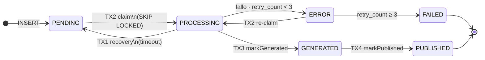

<div align="center">

<!-- BANNER -->
<table bgcolor="#000000" width="100%"><tr><td align="center">

</td></tr></table>

<br/>

<!-- LOGO -->


<br/>
<br/>

<!-- BADGES -->


<br/>


<br/>
<br/>

**Microservicio de generación asíncrona de documentos PDF.**  
Recibe solicitudes vía Kafka · persiste en PostgreSQL · llena plantillas con JasperReports · sube a GCS · publica el resultado de vuelta a Kafka.

<br/>

[📐 Arquitectura](#arquitectura) · [🚀 Arranque rápido](#arranque-rapido) · [🔧 Stack](#stack) · [📚 Documentación](#documentacion) · [🔗 Links útiles](#links-utiles) · [🩺 Diagnóstico](#diagnostico)

</div>

---

<a id="arquitectura"></a>

## 🏗 Arquitectura

El pipeline es completamente asíncrono y orientado a eventos. Un servicio externo publica una solicitud en Kafka; `document-generator-api` se encarga del resto:



### Máquina de estados



> [!TIP]
> Los registros `PROCESSING` que superen el timeout configurado son recuperados automáticamente a `PENDING` al inicio de cada ciclo del scheduler, sin intervención manual.

---

<a id="arranque-rapido"></a>

## 🚀 Arranque rápido

**Pre-requisitos:** Java 21, Docker, Docker Compose 2.x

```bash
# 1. Clonar e ingresar al proyecto
git clone <repo-url> && cd document-generator-api

# 2. Levantar infraestructura (Postgres · Kafka · GCS · Redis · WireMock)
docker-compose up -d

# 3. Ejecutar la aplicación con perfil local
./gradlew bootRun --args='--spring.profiles.active=local'
```

Flyway ejecuta automáticamente las migraciones al arrancar. La app queda lista en `http://localhost:8080/document-generator-api`.

> [!IMPORTANT]
> Si Flyway falla con `"Found non-empty schema data but no schema history table"`, limpiar el schema antes de reiniciar:
> ```bash
> docker exec -it document-generator-api-postgres psql -U user -d files \
>   -c "DROP SCHEMA data CASCADE; CREATE SCHEMA data;"
> ```

### Publicar eventos de prueba

```powershell
# Menú interactivo (4 tipos de template, datos aleatorios)
.\docs\scripts\publish_missions.ps1

# O en modo directo
.\docs\scripts\publish_missions.ps1 -Template 1 -Count 10
.\docs\scripts\publish_missions.ps1 -Template 3 -Count 1 -DryRun
.\docs\scripts\publish_missions.ps1 -List
```

---

<a id="stack"></a>

## 🔧 Stack tecnológico

| Capa | Tecnología | Propósito |
|------|-----------|-----------|
| ☕ Runtime | Java 21 · Spring Boot 3.3.3 · Virtual Threads | Base del microservicio |
| 📄 Generación PDF | JasperReports 7.x | Fill + export de reportes a PDF |
| 🗄️ Persistencia | PostgreSQL 15.2 · Flyway 10.x · Spring Data JPA | Ciclo de vida de solicitudes |
| 📨 Mensajería | Apache Kafka (KRaft) | Eventos de entrada y salida (sin Zookeeper) |
| ☁️ Almacenamiento | Google Cloud Storage | Templates PDF y documentos generados |
| 🔍 Observabilidad | Micrometer · MDC estructurado · New Relic | Métricas y trazabilidad de logs |
| 🔒 Cache local | Redis 7 | Cache distribuida de sesiones |

---

<a id="documentacion"></a>

## 📚 Documentación

### 🔭 01 · Visión general

| Documento | Descripción |
|-----------|-------------|
| [📐 Arquitectura](docs/01-overview/architecture.md) | Flujo completo, máquina de estados, componentes y decisiones técnicas |
| [📋 ADR-001 — Generación asíncrona](docs/01-overview/decisions/ADR-001-generacion-asincrona-documentos.md) | Por qué el pipeline es asíncrono y orientado a eventos |
| [📋 ADR-002 — GCS sobre S3](docs/01-overview/decisions/ADR-002-gcs-sobre-s3.md) | Migración de almacenamiento de S3 a Google Cloud Storage |

### 🧩 02 · Dominio

| Documento | Descripción |
|-----------|-------------|
| [📄 Templates PDF](docs/02-domain/templates.md) | Catálogo de templates, ciclo de vida, registro vía API |
| [🔄 Estados de `raw_data`](docs/02-domain/estados-raw-data.md) | Máquina de estados completa: `PENDING` → `PUBLISHED` |
| [📨 Eventos Kafka](docs/02-domain/events.md) | Esquema de los eventos `requested` y `completed` |

### ⚙️ 03 · Scheduler

| Documento | Descripción |
|-----------|-------------|
| [🔁 Ciclo de procesamiento](docs/03-batch/batch-job.md) | Recovery → claim → generate → publish, fronteras TX |
| [♻️ Recovery de registros colgados](docs/03-batch/recovery.md) | Detección y reseteo de registros `PROCESSING` expirados |
| [📈 Tuning de rendimiento](docs/03-batch/tuning.md) | Parámetros, cálculo de capacidad y estrategias de scaling |

### 🌐 04 · API REST

| Documento | Descripción |
|-----------|-------------|
| [📄 Templates API](docs/04-api/templates-api.md) | `POST /v1/templates` — subir PDFs, parsear campos AcroForm, listar |
| [🗂️ Storage API](docs/04-api/storage-api.md) | `GET/POST/DELETE /v1/storage/files` — gestión de archivos en GCS |
| [⚠️ Códigos de error](docs/04-api/error-codes.md) | Catálogo de errores HTTP y sus causas |

### 🏛️ 05 · Infraestructura

| Documento | Descripción |
|-----------|-------------|
| [🗄️ Base de datos](docs/05-infrastructure/database.md) | Schema `data`, tablas, índices, migraciones Flyway |
| [📨 Kafka](docs/05-infrastructure/kafka.md) | Topics, consumer group, configuración de producer/consumer |
| [☁️ Google Cloud Storage](docs/05-infrastructure/gcs.md) | Bucket, estructura de carpetas, emulador local |
| [🔍 Observabilidad](docs/05-infrastructure/observability.md) | MDC estructurado, métricas Micrometer, New Relic |

### 💻 06 · Desarrollo

| Documento | Descripción |
|-----------|-------------|
| [🛠️ Setup local](docs/06-development/local-setup.md) | Requisitos, docker-compose, primera ejecución, tests |
| [📦 Estructura de paquetes](docs/06-development/package-structure.md) | Organización de clases por capa y responsabilidad |
| [🧪 Estrategia de testing](docs/06-development/testing-strategy.md) | Tests unitarios, de integración y smoke tests |
| [➕ Agregar un nuevo dominio](docs/06-development/adding-a-domain.md) | Paso a paso para incorporar un nuevo tipo de documento |

### 🚨 07 · Operaciones

| Documento | Descripción |
|-----------|-------------|
| [📖 Runbook](docs/07-operations/runbook.md) | Escenarios de fallo frecuentes, diagnóstico y acciones correctivas |
| [☁️ Gestión de templates en GCS](docs/07-operations/gcs-templates.md) | Subir, versionar y desactivar templates PDF en producción |
| [🔧 Trigger manual](docs/07-operations/trigger-manual.md) | Cómo disparar el scheduler manualmente vía endpoint REST |

---

<a id="links-utiles"></a>

## 🔗 Links útiles (local)

| Recurso | URL |
|---------|-----|
| 📘 Swagger UI | `http://localhost:8080/document-generator-api/swagger-ui.html` |
| ❤️ Health check | `http://localhost:8080/document-generator-api/actuator/health` |
| 📄 Templates API | `http://localhost:8080/document-generator-api/v1/templates` |
| 🗂️ Storage API | `http://localhost:8080/document-generator-api/v1/storage/files` |
| 📊 Metrics | `http://localhost:8080/document-generator-api/actuator/metrics` |

---

<a id="diagnostico"></a>

## 🩺 Diagnóstico rápido

```bash
# Conectarse a la BD local
docker exec -it document-generator-api-postgres psql -U user -d files
```

```sql
-- Estado general de solicitudes
SELECT status, count(*) FROM data.raw_data GROUP BY status ORDER BY count DESC;

-- Templates registrados en el catálogo
SELECT name, domain, version, status FROM data.document_templates ORDER BY name;

-- Últimos registros en error
SELECT process_id, template_name, retry_count, error_message
FROM data.raw_data WHERE status IN ('ERROR', 'FAILED')
ORDER BY updated_at DESC LIMIT 10;

-- Registros PROCESSING colgados (> 30 min)
SELECT process_id, template_name, updated_at,
       EXTRACT(EPOCH FROM (now() - updated_at)) / 60 AS minutes_stuck
FROM data.raw_data
WHERE status = 'PROCESSING'
  AND updated_at < now() - INTERVAL '30 minutes';
```

> [!NOTE]
> Ver el [Runbook](docs/07-operations/runbook.md) para guías completas de diagnóstico y resolución de los escenarios de fallo más frecuentes.

---

<div align="center">

**document-generator-api** · Tenpo © 2026

</div>
# document-api
