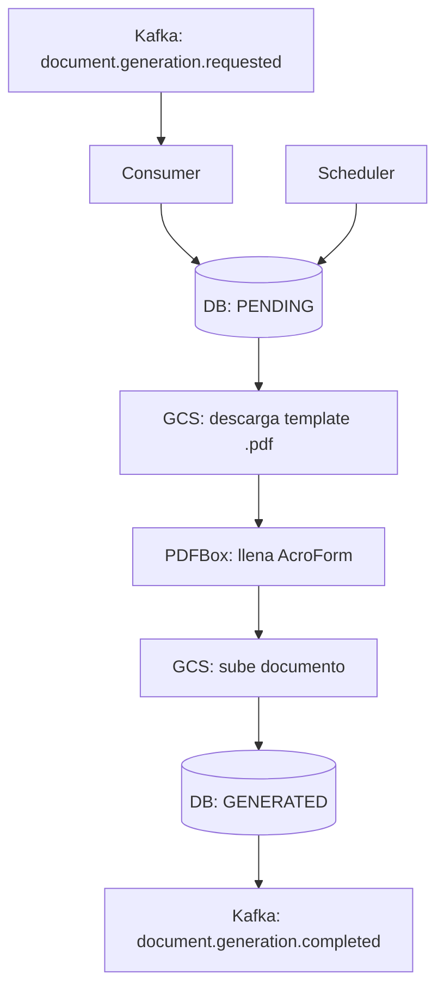
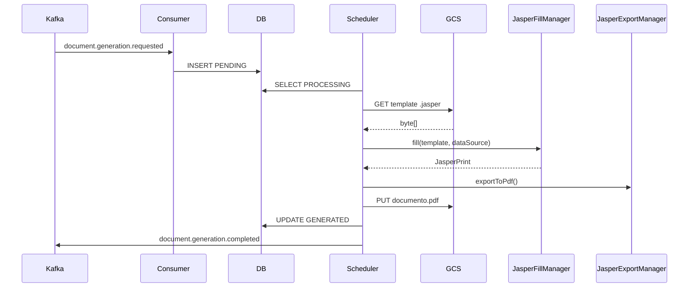
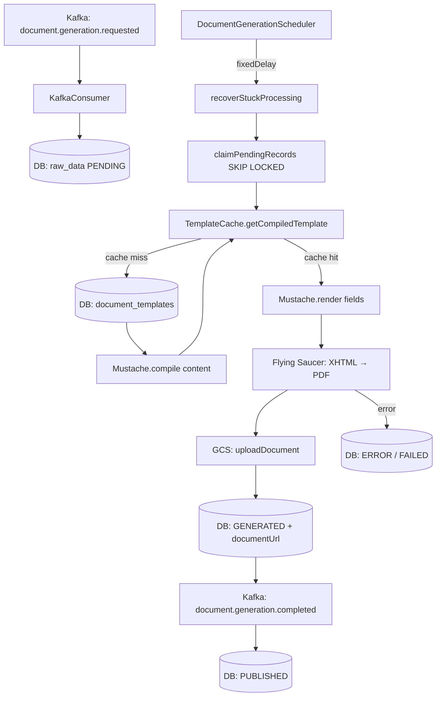
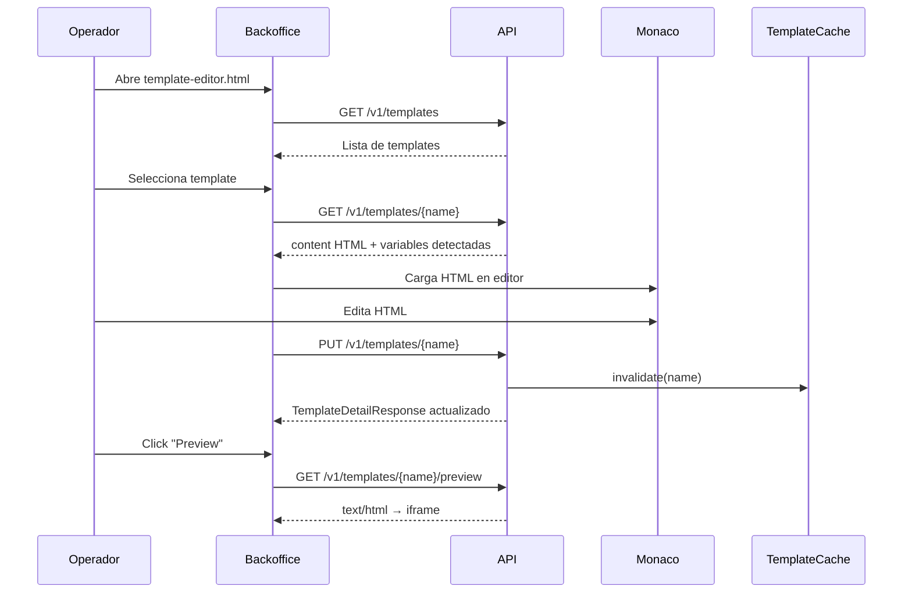

# Spike Técnico - Generación Asíncrona de Documentos PDF con Templates

| Campo | Valor |
|---|---|
| **Ticket** | ADR-001 |
| **Responsable** | Maximiliano Soria |
| **TL Reviewer** | Nombre TL |
| **Fecha** | 2026-05-05 |
| **Estado** | Aprobado |
| **Servicios involucrados** | payment-loyalty, batch-document-generator |
| **Repositorios involucrados** | repo/payment-loyalty, repo/batch-document-generator |

---

## 1. Contexto / Problemática

### Problema actual

Al crear una misión en **payment-loyalty**, el sistema necesita generar un documento asociado (bases y condiciones, certificado de participación, etc.) basado en un template del dominio `MISIONES`.

La generación implica:
- Llenado dinámico de campos sobre un template HTML.
- Conversión del HTML renderizado a PDF.
- Almacenamiento del archivo en un bucket (GCS).
- Notificación al dominio origen (payment-loyalty) con el link del documento generado.

Hacer esto de forma sincrónica dentro del flujo de creación de misión genera:
- Latencia inaceptable en el API de negocio.
- Riesgo de timeout bajo alta carga o volumen de registros.
- Acoplamiento de responsabilidades que no le pertenecen a payment-loyalty.

Adicionalmente, no estaba definida la estrategia técnica para:
- Qué motor de templates y PDF usar.
- Dónde almacenar los templates.
- Cómo gestionar el ciclo de vida de las solicitudes.
- Cómo garantizar idempotencia y resiliencia.

### Impacto

| Dimensión | Descripción |
|---|---|
| **Técnico** | Sin desacople, cualquier error en generación de PDF bloquea la creación de misiones. Sin un componente dedicado, no hay forma de escalar la generación independientemente del API. |
| **Negocio** | Las misiones no pueden tener documentos adjuntos de forma confiable, limitando funcionalidades como certificados, bases legales y contratos por misión. |
| **Riesgos actuales** | Timeouts en creación de misión, duplicación de documentos por reintentos, ausencia de trazabilidad sobre el estado de generación. |

---

## 2. Objetivo del Spike

### Objetivos

- Validar la factibilidad técnica de desacoplar la generación documental de payment-loyalty mediante Kafka y un batch dedicado.
- Definir el motor de templates y PDF a utilizar (Mustache + Flying Saucer vs PDFBox/AcroForm vs JasperReports).
- Definir la estrategia de almacenamiento de templates (BD vs GCS).
- Diseñar el ciclo de vida de las solicitudes y la estrategia de reintentos.
- Obtener una estimación de esfuerzo de implementación.

### Resultado esperado

- Decisión de arquitectura documentada y aprobada.
- Estrategia de templates y PDF definida con POC validado.
- Ciclo de vida de solicitudes de generación definido.
- Estimación por fases de implementación.
- Contratos de eventos Kafka acordados.

---

## 3. Alcance

### Incluye

- Investigación de motores de templates: Mustache.java, JasperReports, PDFBox/AcroForm.
- POC de generación PDF con Mustache + Flying Saucer.
- Diseño del modelo de datos para solicitudes de generación.
- Definición del ciclo de vida: `PENDING → PROCESSING → GENERATED → PUBLISHED / FAILED`.
- Diseño del contrato de eventos Kafka (`document.generation.requested`, `document.generation.completed`).
- Diagrama de flujo completo end-to-end.
- Estimación de esfuerzo por fases.

### No incluye

- Desarrollo productivo completo de todos los templates de negocio.
- QA formal de carga ni stress testing.
- Despliegue a producción ni configuración de infraestructura definitiva.

---

## 4. Propuestas de Solución

### Propuesta A - PDFBox + AcroForm (formularios PDF estáticos)

#### Descripción

Generar PDFs a partir de archivos `.pdf` con campos AcroForm embebidos. El procesador llena los campos del formulario usando la librería Apache PDFBox y guarda el resultado en GCS.

#### Cambios requeridos

- Subir templates como archivos `.pdf` con campos AcroForm a GCS.
- Implementar `PdfFormDocumentGenerator` con PDFBox.
- El cache carga y cachea el `byte[]` del template desde GCS en el primer acceso.
- No requiere motor de templates adicional.

#### Endpoints nuevos/modificados

| Método | Endpoint | Descripción |
|---|---|---|
| `POST` | `/v1/templates` | Sube template `.pdf` con AcroForm a GCS |
| `GET` | `/v1/templates` | Lista templates registrados |

#### Servicios externos involucrados

| Servicio | Tipo comunicación | Descripción |
|---|---|---|
| GCS | SDK | Almacenamiento de templates `.pdf` y documentos generados |
| Kafka | Async | Solicitudes y notificaciones de generación |
| PostgreSQL | JDBC | Estado del ciclo de vida de solicitudes |

#### Flujo



#### Ventajas

- Librería madura y ampliamente usada en el ecosistema Java.
- El template se diseña en cualquier editor de PDF con AcroForm.
- No requiere conocimiento de HTML/CSS.

#### Desventajas

- Los templates son binarios (`.pdf`), difíciles de versionar y editar sin herramientas específicas.
- No hay preview en browser; requiere Acrobat o similar para editar.
- Personalización visual limitada a lo que permite AcroForm.
- Los campos deben llamarse exactamente igual al nombre del campo en el evento Kafka.
- No es viable para templates con layout dinámico (listas de longitud variable, secciones condicionales).

#### Riesgos

- Desincronización entre nombre de campo en el PDF y nombre en el JSON del evento.
- Bloqueo ante necesidad de generar contenido dinámico (listas, condicionales).
- Complejidad para extender a nuevos dominios con layouts distintos.

#### Complejidad

`Media`

#### Estimación

| Item | Horas |
|---|---|
| Implementación generador | 10 |
| Cache de templates desde GCS | 8 |
| Testing unitario e integración | 6 |
| Deploy y configuración | 4 |
| **Total** | **28** |

---

### Propuesta B - JasperReports (motor de reportes Java)

#### Descripción

Generar PDFs a partir de templates `.jrxml` (XML) compilados en tiempo de ejecución con JasperReports. Los templates definen layout con bandas (Header, Detail, Footer) y variables que se llenan con un `JRDataSource`.

#### Cambios requeridos

- Almacenar templates `.jrxml` compilados en GCS.
- Implementar `JasperDocumentGenerator` con `JasperFillManager`.
- El cache cachea el `JasperReport` compilado.
- Requiere dependencias pesadas: `jasperreports`, `iText` (posibles conflictos de licencia).

#### Endpoints nuevos/modificados

| Método | Endpoint | Descripción |
|---|---|---|
| `POST` | `/v1/templates` | Sube template `.jrxml` compilado |
| `GET` | `/v1/templates` | Lista templates registrados |

#### Servicios externos involucrados

| Servicio | Tipo comunicación | Descripción |
|---|---|---|
| GCS | SDK | Almacenamiento de templates compilados y documentos |
| Kafka | Async | Solicitudes y notificaciones de generación |
| PostgreSQL | JDBC | Estado del ciclo de vida |

#### Flujo



#### Ventajas

- Motor muy potente para reportes complejos: sub-reportes, gráficos, tablas dinámicas.
- Ampliamente adoptado en sistemas corporativos.
- Soporta múltiples formatos de salida (PDF, XLSX, HTML).

#### Desventajas

- Curva de aprendizaje alta para diseñar templates `.jrxml`.
- Dependencias pesadas con posibles conflictos de licencia (iText 2.x).
- Templates binarios/XML complejos de mantener y versionar.
- Tiempo de compilación del template agrega latencia.
- Overkill para el caso de uso actual (documentos HTML simples con variables).

#### Riesgos

- Conflictos de licencia con iText en versiones antiguas de Jasper.
- Templates `.jrxml` no editables sin Jaspersoft Studio.

#### Complejidad

`Alta`

#### Estimación

| Item | Horas |
|---|---|
| Implementación generador | 16 |
| Cache y compilación de templates | 10 |
| Testing | 8 |
| Deploy y configuración | 4 |
| **Total** | **38** |

---

### Propuesta C - Mustache.java + Flying Saucer HTML→PDF ✅ SELECCIONADA

#### Descripción

Generar PDFs en dos pasos:
1. **Render HTML**: el template se almacena como HTML con variables `{{campo}}` en la columna `content TEXT` de la tabla `document_templates` en PostgreSQL. El scheduler renderiza el HTML con **Mustache.java** sustituyendo las variables con el JSON del evento.
2. **Conversión a PDF**: el HTML renderizado (XHTML válido con CSS2) se convierte a PDF usando **Flying Saucer** (`ITextRenderer`).

Los templates compilados se cachean en memoria (`ConcurrentHashMap<String, Mustache>`) evitando recompilación en cada ciclo.

#### Cambios requeridos

- Nuevas dependencias: `mustache.java`, `flying-saucer-pdf`
- Columna `content TEXT NOT NULL` en tabla `document_templates`
- `TemplateCache`: cachea `Mustache` compilado + entidad JPA
- `HtmlPdfDocumentGenerator`: render Mustache → conversión Flying Saucer
- `DocumentGenerationScheduler`: orquesta ciclo completo
- API REST de gestión de templates (CRUD + preview + download)
- Backoffice HTML standalone con Monaco Editor para edición de templates

#### Endpoints nuevos/modificados

| Método | Endpoint | Descripción |
|---|---|---|
| `POST` | `/v1/templates` | Sube template `.mustache` (multipart) |
| `GET` | `/v1/templates` | Lista todos los templates |
| `GET` | `/v1/templates/{name}` | Detalle con content HTML y variables detectadas |
| `PUT` | `/v1/templates/{name}` | Edita HTML desde el backoffice |
| `PATCH` | `/v1/templates/{name}/status` | Activa / Pausa / Depreca template |
| `GET` | `/v1/templates/{name}/preview` | Visualiza HTML en browser (`text/html`) |
| `GET` | `/v1/templates/{name}/download` | Descarga como archivo `.html` |
| `GET` | `/v1/templates/{name}/fields` | Lista variables `{{campo}}` detectadas |

#### Servicios externos involucrados

| Servicio | Tipo comunicación | Descripción |
|---|---|---|
| GCS | SDK | Almacenamiento de documentos PDF generados |
| Kafka | Async | Solicitudes (`document.generation.requested`) y notificaciones (`document.generation.completed`) |
| PostgreSQL | JDBC/JPA | Templates (con content HTML) + ciclo de vida de solicitudes (`raw_data`) |

#### Flujo de generación



#### Flujo de gestión de templates (backoffice)



#### Ventajas

- Templates son HTML puro: editables en cualquier editor de texto, versionables en Git, previsualizables en browser.
- Sin dependencias de herramientas propietarias para editar templates.
- `content` en BD permite edición directa desde el backoffice sin subir archivos.
- Cache en memoria elimina queries a BD en tiempo de ejecución del scheduler.
- Flying Saucer soporta CSS2, fonts embebidas y diseño de documentos complejos.
- Mustache es logic-less: evita lógica de negocio dentro del template.
- Variables detectables automáticamente desde el HTML (`{{campo}}`).
- Fácilmente extensible a nuevos dominios sin cambios de código.

#### Desventajas

- Flying Saucer requiere XHTML válido (no HTML5); errores de parseo si el template tiene HTML malformado.
- CSS limitado a CSS2 (sin Flexbox, Grid ni CSS3 moderno).
- Mustache no tiene lógica condicional compleja (por diseño, logic-less).

#### Riesgos

- Templates con HTML inválido (no XHTML) causan `DocumentGenerationException` en runtime.
- Si el operador edita el HTML con CSS3, el PDF puede verse distinto al preview del browser.
- Fuentes personalizadas requieren configuración adicional en Flying Saucer.

#### Complejidad

`Media`

#### Estimación

| Item | Horas |
|---|---|
| Dependencias + configuración | 2 |
| `HtmlPdfDocumentGenerator` | 4 |
| `TemplateCache` | 4 |
| `DocumentGenerationScheduler` | 8 |
| API REST de templates (8 endpoints) | 12 |
| Backoffice Monaco Editor | 8 |
| Flyway migrations + seed templates | 4 |
| Tests unitarios (5 clases) | 12 |
| **Total** | **54** |

---

## 5. Comparativa de Propuestas

| Criterio | Propuesta A (PDFBox/AcroForm) | Propuesta B (JasperReports) | Propuesta C (Mustache + Flying Saucer) ✅ |
|---|---|---|---|
| Complejidad de implementación | Media | Alta | Media |
| Edición de templates | Acrobat / herramienta PDF | Jaspersoft Studio | Cualquier editor HTML / backoffice propio |
| Templates versionables en Git | No (binario) | Parcial (XML) | Sí (HTML texto plano) |
| Contenido dinámico (listas, condicionales) | No | Sí | Parcial (Mustache sections) |
| Preview en browser | No | No | Sí (`text/html` directo) |
| Almacenamiento del template | GCS | GCS | BD (column `content TEXT`) |
| Cache en memoria | `byte[]` | `JasperReport` compilado | `Mustache` compilado |
| Licencias | Apache 2.0 | LGPL / conflicto iText | Apache 2.0 + LGPL v2.1 |
| Extensibilidad a otros dominios | Baja | Media | Alta |
| Tiempo de implementación | 28h | 38h | 54h |
| Riesgo técnico | Bajo | Alto | Bajo-Medio |

---

## 6. Decisión Recomendada

### Solución recomendada

**Propuesta C — Mustache.java + Flying Saucer**

### Justificación

- Los templates como HTML puro son la opción con menor fricción operativa: los operadores pueden editarlos en el backoffice sin herramientas externas, se pueden versionar en Git, y se pueden previsualizar instantáneamente en el browser.
- Almacenar el content en BD (en vez de GCS) elimina una dependencia de red en el hot path del scheduler: el primer acceso carga desde BD y luego todo es en memoria.
- Flying Saucer es suficiente para el caso de uso actual (documentos de misiones con layout relativamente fijo y CSS simple). Si en el futuro se necesita CSS3, se puede migrar a Chrome Headless / Playwright sin cambiar el modelo de datos ni la API.
- El mayor tiempo de implementación (54h vs 28h) se justifica por el backoffice y la API completa de gestión de templates, que reducen la dependencia del equipo de desarrollo para cada cambio de template.

### Tradeoffs aceptados

- Flying Saucer exige XHTML estricto: el equipo de diseño debe validar los templates contra el parser antes de publicarlos a producción.
- CSS limitado a CSS2: se acepta este tradeoff para el MVP; los documentos actuales (certificados, bases de misiones) no requieren CSS3.
- Tiempo de implementación mayor: compensado por la reducción de tiempo operativo en ciclo de vida de templates.

---

## 7. Impactos Técnicos

### Servicios afectados

- `batch-document-generator` — nuevo componente
- `payment-loyalty` — publica evento de solicitud y consume evento de documento generado

### Base de datos

| Cambio | Detalle |
|---|---|
| Nueva tabla | `data.document_templates` con columna `content TEXT NOT NULL` (template HTML embebido) y `status` (`ACTIVE` / `INACTIVE` / `DEPRECATED`) |
| Nueva tabla | `data.raw_data` con ciclo de vida `PENDING → PROCESSING → GENERATED → PUBLISHED / FAILED`, `retry_count`, `idempotency_id` (UNIQUE), `document_url` |
| Índices | `idx_raw_data_status`, `idx_raw_data_idempotency_id` |
| Migraciones | Flyway `V1__init.sql`, `V2__seed_templates.sql` |

### Observabilidad

| Aspecto | Implementación |
|---|---|
| **Logs** | MDC con `processId`, `idempotencyId`, `templateName` en cada ciclo del scheduler |
| **Métricas** | Contadores por estado (`PENDING`, `GENERATED`, `FAILED`), latencia por ciclo (`elapsedMs`) |
| **Trazabilidad** | `idempotencyId` como correlación end-to-end entre payment-loyalty y batch |
| **Alertas** | Alertar cuando registros en estado `FAILED` superen umbral configurado |

### Seguridad

| Aspecto | Detalle |
|---|---|
| **Autenticación GCS** | Service Account con permisos mínimos al bucket |
| **Secrets** | Credenciales GCS via Secret Manager / variables de entorno; no en código |
| **Validaciones** | `idempotencyId` único en BD; `templateName` validado contra catálogo antes de procesar |
| **Bucket** | Acceso privado por defecto; considerar URLs firmadas para acceso externo |

---

## 8. Estrategia de Testing

### Validaciones requeridas

- [x] Unit tests: `DocumentGenerationService`, `HtmlPdfDocumentGenerator`, `StorageService`, `TemplateService`, `TemplateController`, `DocumentGenerationScheduler`
- [ ] Integration tests: ciclo completo con Kafka embebido y PostgreSQL (Testcontainers)
- [ ] Load tests: validar throughput del scheduler con batch de 500 registros concurrentes
- [ ] Manual QA: validar render visual de templates en diferentes escenarios de datos

### Casos críticos

- Evento duplicado en Kafka: debe ignorarse por constraint `UNIQUE` en `idempotency_id`.
- Template inexistente: `TemplateNotFoundException` → `markError` → reintento controlado.
- HTML inválido (no XHTML): `DocumentGenerationException` → `markError`.
- Fallo en GCS upload: excepción atrapada → `markError`, documento no se marca `GENERATED`.
- Scheduler con registros `PROCESSING` colgados: `recoverStuckProcessing` los resetea a `PENDING` al inicio de cada ciclo.
- Batch concurrente multi-pod: `FOR UPDATE SKIP LOCKED` evita procesamiento duplicado.

---

## 9. Estrategia de Despliegue

### Deployment

`Rolling update` — el nuevo servicio es independiente; no hay downtime en payment-loyalty.

### Rollback

Si el nuevo batch presenta errores críticos: los registros en estado `PENDING` / `PROCESSING` permanecen en BD y pueden ser reprocesados al corregir el defecto. payment-loyalty no se ve afectado porque la integración es asíncrona (el link del documento simplemente llega más tarde o queda pendiente).

---

## 10. Dependencias

- **Infraestructura**: bucket GCS creado con acceso privado y service account configurado.
- **Kafka**: tópicos `document.generation.requested` y `document.generation.completed` creados con particionamiento por `idempotencyId`.
- **PostgreSQL**: schema `data` creado; permisos de lectura/escritura para el service account del batch.
- **Accesos**: credenciales GCS disponibles en el entorno de despliegue.
- **Equipo payment-loyalty**: acuerdo sobre contrato de eventos (schema, nombres de campos, claves de partición).

---

## 11. Preguntas Abiertas

1. ¿Se requieren URLs firmadas para los documentos en GCS o el acceso es interno entre servicios?
2. ¿Cuánto tiempo deben persistir los documentos en GCS antes de ser archivados o eliminados?
3. ¿El backoffice de templates requiere autenticación? ¿Quién tiene acceso para editar templates en producción?
4. ¿Se requiere versionado de templates (historial de cambios) o es suficiente con el estado actual?
5. ¿Cuál es el SLA esperado entre la creación de una misión y la disponibilidad del documento generado?
6. ¿Qué pasa con las misiones cuyo documento nunca se genera (retries agotados)? ¿Se notifica al operador?

---

## 12. Checklist Final

- [x] Problema claramente definido
- [x] Propuestas comparadas (PDFBox, JasperReports, Mustache+FlyingSaucer)
- [x] Diagramas agregados (flujo de generación + flujo de backoffice)
- [x] Endpoints documentados (8 endpoints REST de templates)
- [x] Integraciones externas documentadas (Kafka, GCS, PostgreSQL)
- [x] Riesgos identificados
- [x] Estimaciones agregadas por propuesta
- [ ] Validación TL realizada
- [x] Estrategia de testing definida
- [x] Estrategia de despliegue definida

---

## 13. Aprobación

| Rol | Nombre | Estado |
|---|---|---|
| Developer | Maximiliano Soria | Aprobado |
| TL | Nombre TL | Pendiente |
| Arquitectura _(opcional)_ | Nombre Arquitecto | Pendiente |

---

## Anexo — Contrato de Eventos Kafka

### Evento de solicitud de generación (`document.generation.requested`)

```json
{
  "idempotencyId": "mission-123-document-001",
  "domain": "MISIONES",
  "templateName": "mission-template-v1",
  "fields": {
    "missionName": "Compra en comercios adheridos",
    "startDate": "2026-05-05",
    "endDate": "2026-06-05",
    "conditions": "Aplica para clientes segmentados"
  }
}
```

### Evento de documento generado (`document.generation.completed`)

```json
{
  "idempotencyId": "mission-123-document-001",
  "domain": "MISIONES",
  "templateName": "mission-template-v1",
  "documentUrl": "gs://batch-document-generator/documents/misiones/mission-123-document-001.pdf",
  "status": "GENERATED",
  "processedAt": "2026-05-05T15:00:00Z"
}
```

### Ciclo de vida de una solicitud

```
PENDING → PROCESSING → GENERATED → PUBLISHED
                    ↘
                     ERROR (reintentable, max 3) → FAILED (terminal)
```

| Estado | Descripción |
|---|---|
| `PENDING` | Solicitud recibida desde Kafka, en espera de procesamiento |
| `PROCESSING` | Reclamada por el scheduler (`SKIP LOCKED`), generando PDF |
| `GENERATED` | PDF generado y subido a GCS; `document_url` disponible |
| `PUBLISHED` | Evento publicado a Kafka; payment-loyalty notificado |
| `ERROR` | Fallo transitorio; `retry_count < 3`; elegible para reintento |
| `FAILED` | Fallo terminal; `retry_count = 3`; requiere intervención manual |
