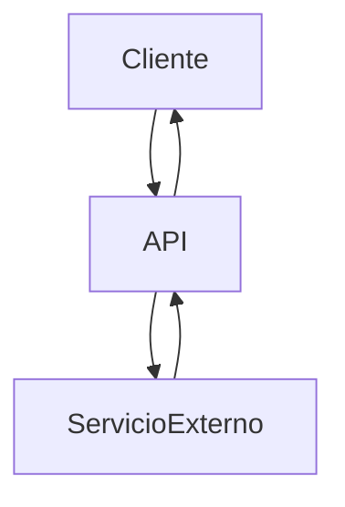
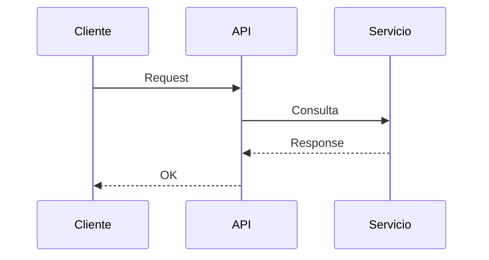

# Spike Técnico - [NOMBRE DEL SPIKE]

| Campo | Valor |
|---|---|
| **Ticket** | ABC-123 |
| **Responsable** | Nombre Apellido |
| **TL Reviewer** | Nombre TL |
| **Fecha** | YYYY-MM-DD |
| **Estado** | Draft / En revisión / Aprobado |
| **Servicios involucrados** | servicio-a, servicio-b |
| **Repositorios involucrados** | repo-api, repo-worker |

---

## 1. Contexto / Problemática

### Problema actual

Describir claramente el problema técnico o incertidumbre que se busca resolver.

> **Ejemplos:**
> - No existe integración con proveedor X.
> - El flujo actual genera timeout bajo alta carga.
> - No está claro si WebFlux soporta el caso de uso requerido.
> - No está claro qué se gana usando virtual threads.

### Impacto

| Dimensión | Descripción |
|---|---|
| **Técnico** | Impacto técnico |
| **Negocio** | Impacto negocio |
| **Riesgos actuales** | Riesgos actuales |

---

## 2. Objetivo del Spike

### Objetivos

- Validar factibilidad técnica.
- Comparar alternativas.
- Identificar riesgos.
- Obtener estimación más precisa.

### Resultado esperado

Definir qué debe quedar claro al finalizar el spike.

> **Ejemplos:**
> - Decisión de arquitectura.
> - Estrategia recomendada.
> - POC funcional.
> - Definición de esfuerzo.

---

## 3. Alcance

### Incluye

- Investigación técnica.
- POC.
- Diagramas.
- Estimaciones.

### No incluye

- Desarrollo productivo completo.
- QA formal.
- Despliegue a producción.

---

## 4. Propuestas de Solución

### Propuesta A - [Nombre]

#### Descripción

Explicar solución propuesta.

#### Cambios requeridos

- Nuevos endpoints
- Nuevos componentes
- Cambios DB
- Configuración
- Infraestructura

#### Endpoints nuevos/modificados

| Método | Endpoint | Descripción |
|---|---|---|
| `POST` | `/api/v1/example` | Crea recurso |
| `GET` | `/api/v1/example/{id}` | Obtiene recurso |

#### Servicios externos involucrados

| Servicio | Tipo comunicación | Descripción |
|---|---|---|
| Payment API | REST | Procesamiento pagos |
| Kafka | Async | Publicación eventos |

#### Flujo

#### Ventajas

- Ventaja 1
- Ventaja 2

#### Desventajas

- Desventaja 1
- Desventaja 2

#### Riesgos

- Riesgo 1
- Riesgo 2

#### Complejidad

`Baja / Media / Alta`

#### Estimación

| Item | Horas |
|---|---|
| Desarrollo | 12 |
| Testing | 4 |
| Deploy | 2 |
| **Total** | **18** |

---

### Propuesta B - [Nombre]

#### Descripción

Explicar solución propuesta.

#### Cambios requeridos

- Item 1
- Item 2

#### Endpoints nuevos/modificados

| Método | Endpoint | Descripción |
|---|---|---|
| `POST` | `/api/v1/example` | Crea recurso |
| `GET` | `/api/v1/example/{id}` | Obtiene recurso |

#### Servicios externos involucrados

| Servicio | Tipo comunicación | Descripción |
|---|---|---|
| Payment API | REST | Procesamiento pagos |
| Kafka | Async | Publicación eventos |

#### Flujo

#### Ventajas

- Ventaja 1

#### Desventajas

- Desventaja 1

#### Riesgos

- Riesgo 1

#### Complejidad

`Media`

#### Estimación

| Item | Horas |
|---|---|
| Desarrollo | 12 |
| Testing | 4 |
| Deploy | 2 |
| **Total** | **18** |

---

## 5. Comparativa de Propuestas

| Criterio | Propuesta A | Propuesta B |
|---|---|---|
| Complejidad | Baja | Media |
| Escalabilidad | Media | Alta |
| Tiempo implementación | 18h | 28h |
| Riesgo | Bajo | Medio |
| Mantención | Media | Alta |

---

## 6. Decisión Recomendada

### Solución recomendada

Indicar cuál propuesta se recomienda y por qué.

### Justificación

- Motivo 1
- Motivo 2

### Tradeoffs aceptados

_Describir los tradeoffs que se aceptan al elegir esta solución._

---

## 7. Impactos Técnicos

### Servicios afectados

- `servicio-a`
- `servicio-b`

### Base de datos

- Nuevas tablas
- Nuevos índices
- Migraciones

### Observabilidad

| Aspecto | Descripción |
|---|---|
| Logs | |
| Métricas | |
| Trazabilidad | |
| Alertas | |

### Seguridad

| Aspecto | Descripción |
|---|---|
| Autenticación | |
| Autorización | |
| Secrets | |
| Validaciones | |

---

## 8. Estrategia de Testing _(si aplica)_

### Validaciones requeridas

- [ ] Unit tests
- [ ] Integration tests
- [ ] Load tests
- [ ] Manual QA

### Casos críticos

- Caso 1
- Caso 2

---

## 9. Estrategia de Despliegue _(si aplica)_

### Deployment

`Feature flag / Canary / Rolling update`

### Rollback

Explicar estrategia de rollback.

---

## 10. Dependencias _(si aplica)_

- Equipo X
- Infraestructura
- Accesos / Credenciales
- Definiciones de negocio

---

## 11. Preguntas Abiertas

1. Pregunta 1
2. Pregunta 2

---

## 12. Checklist Final

- [ ] Problema claramente definido
- [ ] Propuestas comparadas
- [ ] Diagramas agregados
- [ ] Endpoints documentados
- [ ] Integraciones externas documentadas
- [ ] Riesgos identificados
- [ ] Estimaciones agregadas
- [ ] Validación TL realizada
- [ ] Estrategia de testing definida
- [ ] Estrategia de despliegue definida

---

## 13. Aprobación

| Rol | Nombre | Estado |
|---|---|---|
| Developer | Test Dev | Pendiente |
| TL | Test TL | Pendiente |
| Arquitectura _(opcional)_ | Test Arqui | Pendiente |
